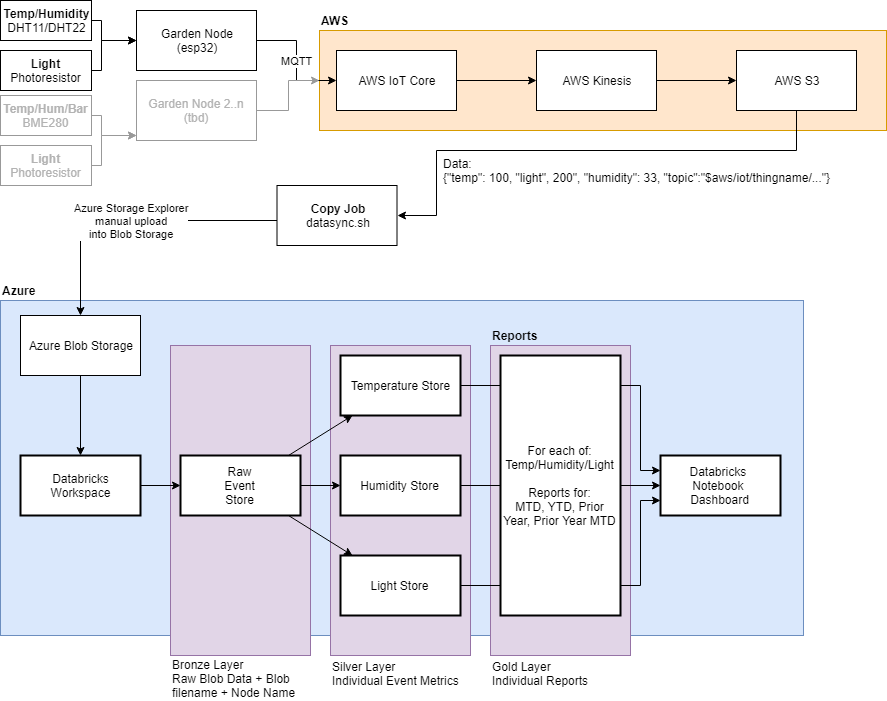

# Garden Node Databricks Reporting

## Objective

* Implement a Databricks solution for analysis of garden node event data.

## Getting Started

* [esp32_garden_node public repository](https://github.com/hadmacker/esp32_garden_node_pub)
* [AWS CLI Configuration](https://docs.aws.amazon.com/cli/latest/userguide/cli-configure-quickstart.html)
  * Used to download files from garden node esp32 device.
    * AWS CLI command from .\data folder: `aws s3 sync s3://garden-nodes .`
* [Azure Storage Explorer](https://azure.microsoft.com/en-ca/features/storage-explorer/)
  * Amazing tool, easily upload nested folders of `.\data` for example.

## TODO

* [x] Create Azure Storage Account
* [x] Upload data files
* [x] Create Databricks instance
* [x] Create Databricks cluster (DS3 v2) [Cluster Pricing](https://azure.microsoft.com/en-ca/pricing/details/databricks/)
* [x] Connect Databricks instance to Azure Storage Account 
  * Added environment variable `GARDENDATA_STORAGEKEY` with Azure Storage Account Key. [This link](https://docs.microsoft.com/en-us/azure/databricks/data/data-sources/azure/azure-storage) has other methods to connect Azure Blob Storage.
* [ ] Job to injest data into Databricks Bronze Layer
* [ ] Job to injest data into Databricks Silver Layer
* [ ] Job to injest data into Databricks Gold Layer
* [ ] Event Hubs
* [ ] Create Event Hub Listener to write images to Storage Account
* [ ] Job to injest data into Databricks Gold Layer + trigger events
* [ ] Add more data into Databricks
* [ ] Add copy job from S3 to Azure

## Databricks Notes

* [Azure Databricks Pricing](https://azure.microsoft.com/en-ca/pricing/details/databricks/)
  * DS3 v2 4 vCPU 14 GiB RAM 0.75 DBU $0.743/hour CAD
* Linking to Azure Storage Account
  * https://caiomsouza.medium.com/how-to-connect-azure-databricks-with-azure-blob-storage-1b3307620524
    * Add Storage Account Access Key to Databricks cluster environment variables.
  * https://www.sqlshack.com/accessing-azure-blob-storage-from-azure-databricks/
  * https://forums.databricks.com/questions/25088/read-json-file-to-azure-sql.html
* Cluster Libraries
  * com.microsoft.azure:azure-eventhubs-spark_2.12:2.3.18
  * com.databricks:spark-xml_2.12:0.11.0
* [Reading JSON files in Databricks](https://docs.microsoft.com/en-us/azure/databricks/data/data-sources/read-json)
* [ls recursive databricks](https://stackoverflow.com/questions/63955823/list-the-files-of-a-directory-and-subdirectory-recursively-in-databricksdbfs)

## Databricks Documentation
* [SQL Reference](https://spark.apache.org/docs/3.1.1/sql-ref.html)
* Python API (PySpark)
  * When in doubt, just add `from pyspark.sql.functions import *` to the top of every command. 
  * [PySpark (Latest)](https://spark.apache.org/docs/3.1.1/api/python/reference/index.html)
  * [PySpark (3.1.1)](https://spark.apache.org/docs/3.1.1/api/python/reference/pyspark.sql.html)
  * [PySpark (3.0.1)](https://spark.apache.org/docs/3.0.1/api/python/pyspark.sql.html#module-pyspark.sql)
    * Data Types: https://spark.apache.org/docs/3.0.1/sql-ref-datatypes.html
    * DateTime Patterns: https://spark.apache.org/docs/3.0.1/sql-ref-datetime-pattern.html 
* [Apache Spark 3.1.1 Documentation:](https://spark.apache.org/docs/3.1.1/)
* [Databricks Delta Engine guide](https://docs.databricks.com/delta/)
* [Azure Databricks Documentation](https://docs.microsoft.com/en-us/azure/databricks/)
* [Microsoft: Table streaming reads and writes](https://docs.microsoft.com/en-us/azure/databricks/delta/delta-streaming)
* [Microsoft: SQL reference for SQL Analytics](https://docs.microsoft.com/en-us/azure/databricks/sql/language-manual)
* [Microsoft: SQL Analytics Quickstart: Run and visualize a query](https://docs.microsoft.com/en-us/azure/databricks/sql/get-started/user-quickstart)
* [How to connect databricks with Azure Blob Storage](https://caiomsouza.medium.com/how-to-connect-azure-databricks-with-azure-blob-storage-1b3307620524)

## Libraries

### Boto3 (Python, AWS)

* [Downloading Files, Amazon S3](https://boto3.amazonaws.com/v1/documentation/api/latest/guide/s3-example-download-file.html)

## Questions

* Q: Why are you using both AWS and Azure in this solution?
  * A: I used to work with AWS. I now work with Azure. It's easier for me to get invoice credits in Azure than AWS currently so that's where I'm continuing the project.
